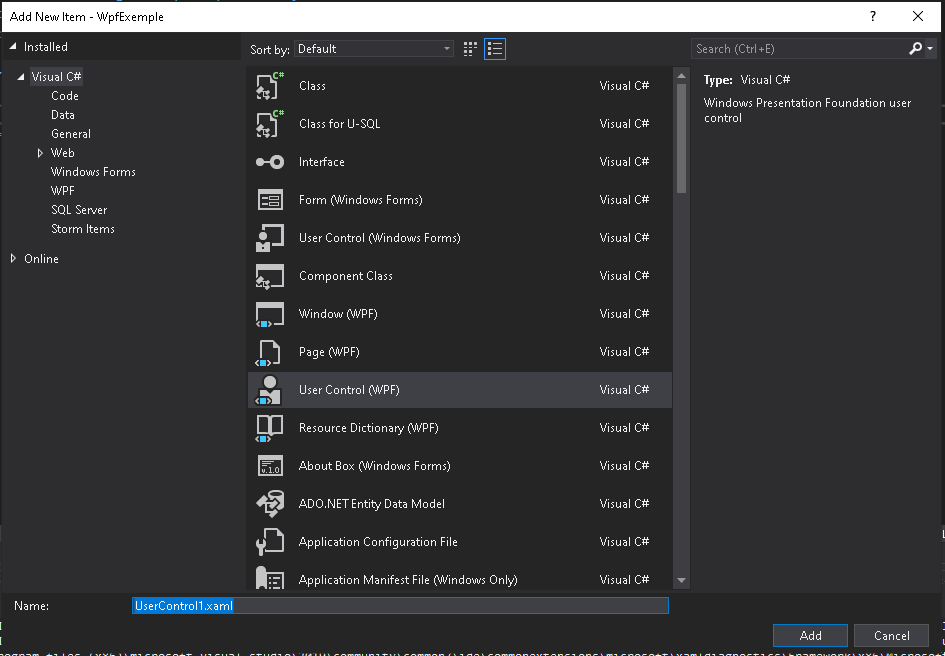

# WpfExemple
ceci est un projet WPF exemple permettant de passer d'une page à une autre sans changer la fenetre d'affichage

:warning: Le projet utilise des évenements customs qui n'ont pas encore étés vus au cours de théorie.

:warning: Les nouvelles pages à créer sont en réalité des WPFUserControl

